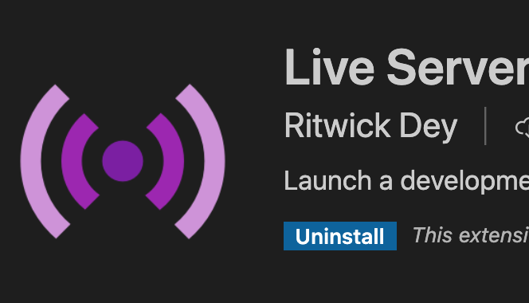

# Import & export en JS Introduction

## Définition module

Un module est une factorisation d'un code métier que l'on peut utiliser dans d'autres programmes. Vous pouvez définir vos propres modules ou utiliser des modules développés par la communauté JS.

Nous allons vous montrer dans deux contextes différents comment faire des import/export en ES6.

Vous avez deux exemples dans le dossier Examples de ce chaptire :

- Examples/InNodeJS

- Examples/HTML

1. Examples/InNodeJS

Structure des dossiers et fichiers :

```text
InNodeJS/
    core/
        parse.js
    app.js
    config.js
    package.json
```

Si vous utilisez les modules dans le contexte NodeJS, vous devez définir dans votre dossier de travail un fichier package.json; dans lequel il faudra définir l'utilisation de la syntaxte ES6. En effet, celle-ci vous permettra l'utilisation des imports/exports de JS.

- Fichier package.json, regardez dans le dossier

```json
{ "type": "module" }
```

Testez le code pour voir si tout marche correctement, dans le dossier InNodeJS :

```bash
node app.js

// dans la console
API : ABC123
PASS : 123
Phrase parsing  891819 891819
```

## export par défaut

Vous ne pouvez faire qu'un export, de constante, fonction ou classe par défaut et par fichier.

Dans le fichier core/parse.js nous exportons la fonction parse que nous utilisons dans le fichier app.js.

L'export default vous permet lors de l'import de le renommer, si vous le souhaitez.

```js
// Dans le fichier parse.js
export default const parse = () => console.log("parsing...");

// Dans le fichier app.js vous pouvez renommer cette constante
import superParser from './core/parse.js';
``` 

## exports multiples

Vous n'êtes pas limité dans l'export de constantes, fonctions ou classes, attention cependant à la syntaxe à respecter.

```js
export const API = "ABC123";
export const PASS = "123";

export const sayHello = message => `Voici mon message ${messaqge}`;
```

De manière équivalente pour l'export multiple, vous pouvez utiliser la syntaxe suivante :

```js
const API = "ABC123";
const PASS = "123";

const sayHello = message => `Voici mon message ${messaqge}`;

export { API, PASS, sayHello };
```

## import 

Les exemples d'import sont faits dans le fichier app.js.

Pour importer une constante, fonction ou classe qui a été exportée par défaut, vous pouvez dans ce cas le renommer. Voyez l'exemple ci-dessous :

```js
import parseDigit from './core/parse.js';

// appel de la fonction exportée
parseDigit('ma phrase9909: hhh:  9897');
```

Si on importe des constantes, classes ou fonctions (export multiple) alors on utilisera la syntaxe suivante :

```js
import { API, PASS } from './config';

console.log(API, PASS);
```

Notez que vous pouvez utiliser des alias pour renommer vos imports :

```js
import { API as myAPI , PASS as myPass } from './config';

console.log(myAPI, myPass);
```

## Imports multiples

Vous pouvez également importer l'ensemble des éléments exportés à l'aide de la syntaxe suivante :

```js

import * as myCore from './core/utiles.js';

```

Pour le choix de l'alias vous êtes libre de choisir le nom que vous souhaitez. JS importera dans ce cas un objet de type module. Pour accéder aux éléments du module vous utiliserez la syntaxe suivante :

```js
myCore.API;
myCore.parser("hello:");
// ...
```

## Dans le contexte du navigateur Web (import/export)

### Introduction

Vous pouvez importer des scripts depuis un fichier externe avec la balise script dans la page HTML. Cette technique marche très bien, mais si vous avez de nombreux scripts à importer dans un projet donné, vous devez dans ce cas faire autant d'import avec cette balise que vous avez de scripts; ceci entraînera autant d'appels serveurs.

De plus vous devez faire attention à l'ordre dans lequel vous importez vos fichiers pour gérer leurs dépendances.

Cette manière d'importer ces fichiers définira un scope unique pour l'ensemble de vos variables.

Pour éviter cette gestion de dépendances complexe, nous allons mettre en place un fichier de type point d'entrée de l'application.

Récupérez l'exemple dans le dossier Examples.

Vous devez également installer un module pour vscode, il nous permettra de lancer un live server :



Allez dans la partie installation de module et installez Live Server de Ritwick Dey.

Une fois installé, vous devriez voir dans la barre d'état en bas à droite de vscode un bouton "Go Live". Cliquez dessus, le live serveur lancera votre navigateur par défaut. Naviguez ensuite dans l'arborescence de vos dossiers et fichiers pour afficher la page index.html.

*Remarque : le live server se lance à la racine de votre projet vscode.*

Dans cette page nous n'avons qu'à charger le fichier app.js en mentionnant à notre navigateur que le fichier importé utilise des modules. Voyez l'attribut type="module" dans la balise script ci-dessous, ce code se trouve dans la page index.html : 

```html
 <script type="module" src="./app.js"></script>
 ```
 Le code devrait fonctionner correctement. Pour le vérifier inspectez (console) la page Web, vous devriez voir :

```text
API : ABC123  app.js:12 
PASS : 123    app.js:15 
```

Remarque : ne cherchez pas à afficher la page index.html directement depuis votre explorateur de dossiers et fichiers de votre ordinateur; passez par le Live Server de vscode.

Pour arrêter le Live Server dans vscode, cliquez en bas à droite sur l'onglet suivant :
**Port: 5500**

Remarque : le port peut éventuellement être différent.

